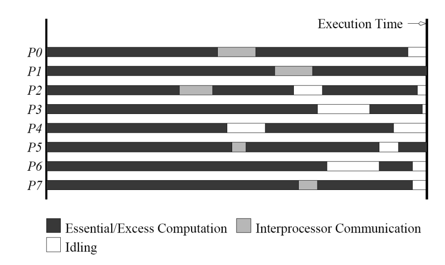
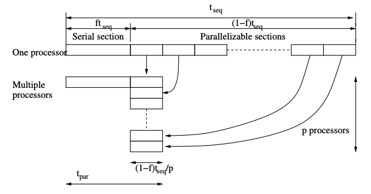
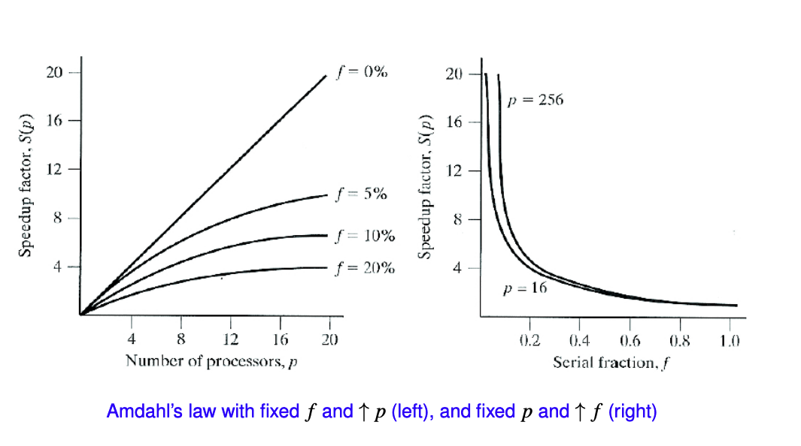

# Acknowledgement

The content of this post is based on a summary of the Parallel systems (COMP8300) course at the Australian National University,
which I have greatly benefited from. Thanks to lecturers Dr. Alberto F. Martin, Prof. John Taylor.

# Parallel Speedup and Efficiency
**Speedup （加速比）** is a measure of the relative performance between a single and a multiprocessor parallel system when solving a fixed size problem

$$
S_p=\dfrac{\text{execution time on a single processor}}{\text{execution time using } p \text{ processors}} = \dfrac{t_\text{seq}}{t_\text{par}}
$$

$t_\text{seq}$ typically defined as the time for the *fastest* known sequential algorithm, sometimes (but not always) we need a different algorithm for parallelization.

Ideally, $S_p = p$ (aka linear speedup), sometimes also super-linear speed-up ($S_p>p$). Examples: super-linear complexity; cache memory effects

**Efficiency** is a measure of how far we are from ideal speed-up. Defined as:

$$
E_p=\dfrac{S_p}{p}
$$

clearly, $0 < E_p \leq 1$. Optimally, $E_p = 1$

# Parallel Overheads
Why cannot we expect $S_p = p$ for arbitrarily large $p$ ?
Parallelization-related overheads (examples):
- interprocessor communication and synchronization
- idling (caused typically by load imbalance, data dependencies, serial parts)
- excess computation (e.g., higher #iters. with p, communication-avoiding algs)



## Embarrassingly parallel
A problem that can be solved without communication is called **embarrassingly parallel**. Clearly, will have $E_p \approx 1$ for large $p$.
However, even under this scenario $E_p$ will always drop for some (large) $p$ due to resource underutilization caused by very little data winded up on each processor.

# Scalability
**Scalability（可扩展性）** is a very broad term, used in many different contexts, which relates to the ability of a parallel system (algorithm + code + hardware) to exploit efficiently increasing computational resources
## Hardware scalability
Does increasing the size of the hardware give increased performance?
e.g. aggregated memory bandwidth is typically limited as we scale $p$ in shared-memory multiprocessors.

## Algorithm scalability
At which rate does the complexity of an algorithm (number of operations and memory) grow with increasing problem size?
Example: for two dense $N\times N$ matrices, doubling hte value of $N$ increases the cost of matrix addition by a factor of 4, but the cost of matrix multiplication by a factor of $8$ (i.e. $O(N^2)$ versus $O(N^3)$ complexity)

## Strong parallel scalability
At which rate the efficiency of a parallel algorithm decays with increasing number of processors and fixed problem size?

## Weak parallel scalability (Previous two combined)
At which rate the efficiency of parallel algorithm decays as we increase BOTH the number of processors and problem size?

# Amdahl's Law
## Definition
Considers "sequential parts" as the only source of overhead
Let $f$ the (sequential) fraction of a computation that cannot be split into parallel tasks. Then, max speed up achievable for arbitrary large $p$ is $\dfrac{1}{f}$.
$$
t_\text{par}=ft_\text{seq}+\dfrac{(1-f)t_\text{seq}}{p}
$$
$$
S_p=\dfrac{t_\text{seq}}{t_\text{par}}=\dfrac{p}{pf+(1-f)}
$$

$$
\lim_{{p \to \infty}} S_p = \dfrac{1}{f}
$$



It is a **strong scaling** law, assumeing fixed problem size.
# Gustafson's Law
Amdahl's law was thought to show that large $p$ would never pay off, however, it assumes fixed problem size executed on more and more processors. In practice, this is not the case. One typically tailors problem size to $p$ (weak scaling).

A more realistic assumption is that parallel fraction can be arbitrarily extended.

Assume that the sequential portion of a parallel code is independent on $p$, and that the problem size can be scaled s.t. the parallelizable portion is $p$ times larger. Then, the scaled speed-up:

$$
S_\text{scaled p} = \dfrac{T_\text{scaled seq}}{T_\text{par}}=\dfrac{T_\text{seq}f+pT_\text{seq}(1-f)}{T_\text{seq}f+T_\text{seq}(1-f)} = \dfrac{f+p(1-f)}{f+(1-f)}=f+p(1-f)=p-f(p-1)
$$
is now an unbounded linear function with $p$ (with slope depending of $f$)

It is a **weak scaling** law, assuming problem size scaled in proportion with $p$.

> 作为对比，阿姆德尔定律将单个处理器的执行时间作为定量跟并行执行时间相比。因此阿姆德尔定律是基于固定的问题规模提出的，它假设程序的整体工作量不会随着机器规模（也就是处理器数量）而改变。古斯塔夫森定律补充了阿姆德尔定律没有考虑解决问题所需的资源总量的不足。古斯塔夫森定律解决了这个问题， 它表明设定并行解决方案所允许耗费的时间的最佳方式是考虑所有的计算资源和基于这类信息。
> from https://blog.imkasen.com/parallel-performance-metrics/

# Measuring Time
In order to evaluate performance of parallel algorithms we need to accurately measure computation times.

Broadly speaking, there are two kind of times: **wall clock time** (i.e. elapsed time) and **CPU time**

>**Walltime** is the actual time taken from the start of a computer program to the end.
>**CPU time** measures only the time during which the processor is actively working on a certain task or process.
>from https://en.wikipedia.org/wiki/Elapsed_real_time

Two important timer parameters are **timer resolution ($t_R$)** and **overhead($t_O$)**
$t_R$ is the smallest unit of time that can be accurately measured by the timer
- the lower the $t_R$ the higher the resolution
- if the event to be time is shorter than timer resolution, we can't measure it

$t_O$ relates to the instructions which are executed and included in the measured time and not strictly related toe the event being measured.

$t_R$ and $t_O$ can be estimated measuring (differences between) repeated calls to a **timer function**.


`MPI_Wtick()` shows the resolution. `MPI_Wtime()` returns an elapsed time on the calling processor.

The following code tests the resolution and overhead of `MPI_Wtime()`

```c
double *time = (double *)calloc(num_measurements, sizeof(double));
double avg = 0;
for (int i = 0; i < num_measurements; i++) {
	// Measure the time twice in quick succession 
	double start = MPI_Wtime(); 
	double end = MPI_Wtime(); 
	time[i] = end - start; 
	avg += (double) time[i]; 
} 
avg = avg / num_measurements; 

printf("First 200 timings:\n"); 

for (int i = 0; i < 10; i++) {
	for (int j = 0; j < 20; j++) {
		printf("%.1e ", time[i * 20 + j]);
		} 
	printf("\n");
} 
printf("Average: %.2e us\n", avg);
```

We got a sample output like:
```c
First 200 timings:
1.8e-07 3.9e-08 2.4e-08 2.7e-08 2.5e-08 2.5e-08 2.6e-08 2.5e-08
2.5e-08 2.6e-08 2.4e-08 2.4e-08 2.6e-08 2.4e-08 2.5e-08 2.7e-08
2.5e-08 2.4e-08 2.6e-08 2.6e-08 2.4e-08 2.7e-08 2.6e-08 2.4e-08
2.6e-08 2.6e-08 2.4e-08 2.7e-08 2.7e-08 2.4e-08 2.5e-08 2.6e-08
2.4e-08 2.6e-08 2.6e-08 2.5e-08 2.6e-08 2.6e-08 2.4e-08 2.7e-08
2.7e-08 2.4e-08 2.5e-08 2.6e-08 2.4e-08 2.6e-08 2.7e-08 2.5e-08
2.6e-08 2.6e-08 2.3e-08 2.5e-08 2.6e-08 2.4e-08 2.5e-08 2.6e-08
2.4e-08 2.4e-08 2.6e-08 2.4e-08 2.5e-08 2.7e-08 2.4e-08 2.4e-08
2.6e-08 2.4e-08 2.5e-08 2.6e-08 2.4e-08 2.4e-08 2.7e-08 2.4e-08
2.4e-08 2.6e-08 2.4e-08 2.5e-08 2.6e-08 2.4e-08 2.5e-08 2.6e-08
2.4e-08 2.4e-08 2.6e-08 2.5e-08 2.4e-08 2.6e-08 2.4e-08 2.5e-08
2.6e-08 2.6e-08 2.5e-08 2.6e-08 2.6e-08 2.5e-08 2.7e-08 2.6e-08
2.5e-08 2.6e-08 2.6e-08 2.5e-08 2.6e-08 2.7e-08 2.5e-08 2.7e-08
2.7e-08 2.4e-08 2.6e-08 2.6e-08 2.4e-08 2.6e-08 2.6e-08 2.5e-08
2.6e-08 2.6e-08 2.4e-08 2.6e-08 2.5e-08 2.4e-08 2.7e-08 2.7e-08
2.5e-08 2.4e-08 2.6e-08 2.5e-08 2.4e-08 2.6e-08 2.4e-08 2.5e-08
2.6e-08 2.3e-08 2.5e-08 2.6e-08 2.5e-08 2.4e-08 2.6e-08 2.4e-08
2.4e-08 2.6e-08 2.4e-08 2.4e-08 2.6e-08 2.5e-08 2.5e-08 2.6e-08
2.4e-08 2.3e-08 2.6e-08 2.4e-08 2.4e-08 2.6e-08 2.4e-08 2.4e-08
2.7e-08 2.7e-08 2.5e-08 2.6e-08 2.6e-08 2.5e-08 2.6e-08 2.6e-08
2.5e-08 2.7e-08 2.7e-08 2.5e-08 2.6e-08 2.6e-08 2.5e-08 2.6e-08
2.6e-08 2.5e-08 2.7e-08 2.6e-08 2.4e-08 2.5e-08 2.6e-08 2.4e-08
2.6e-08 2.5e-08 2.4e-08 2.7e-08 2.7e-08 2.4e-08 2.6e-08 2.6e-08
2.4e-08 2.6e-08 2.7e-08 2.4e-08 2.7e-08 2.6e-08 2.4e-08 2.5e-08
2.6e-08 2.5e-08 2.5e-08 2.7e-08 2.4e-08 2.4e-08 2.5e-08 2.4e-08
Average: 2.47e-08 us
```

So we can read off the average overhead to be `2.47e-8` seconds.
